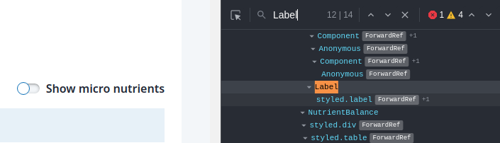
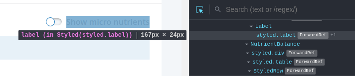
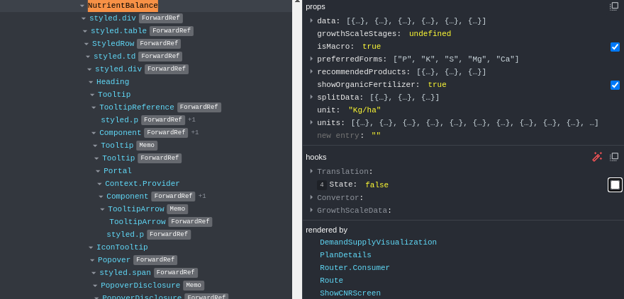
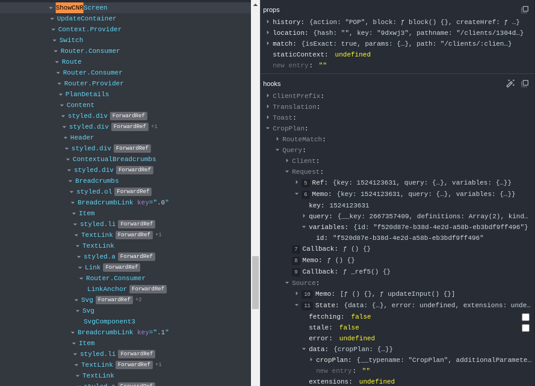
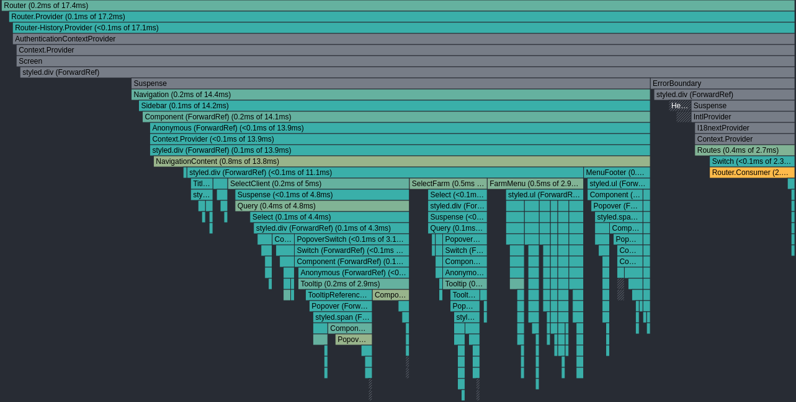
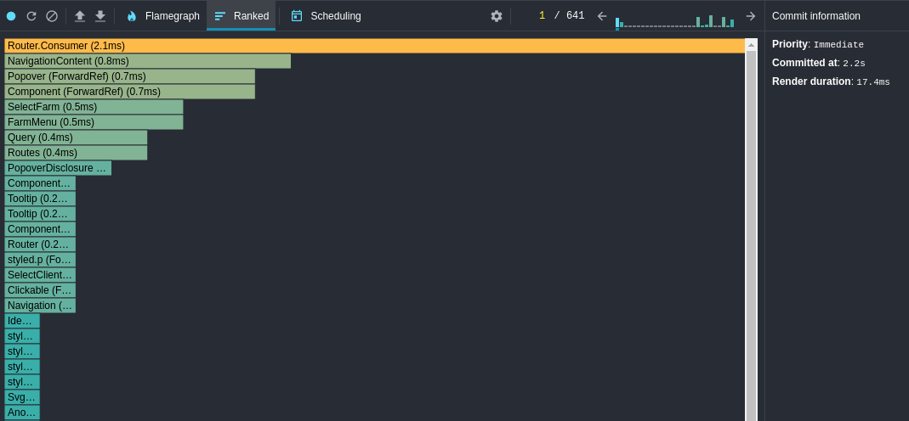
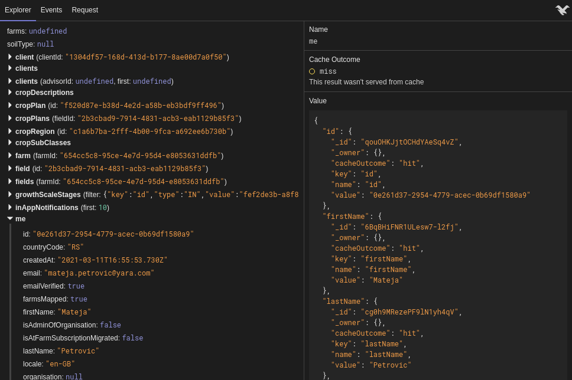
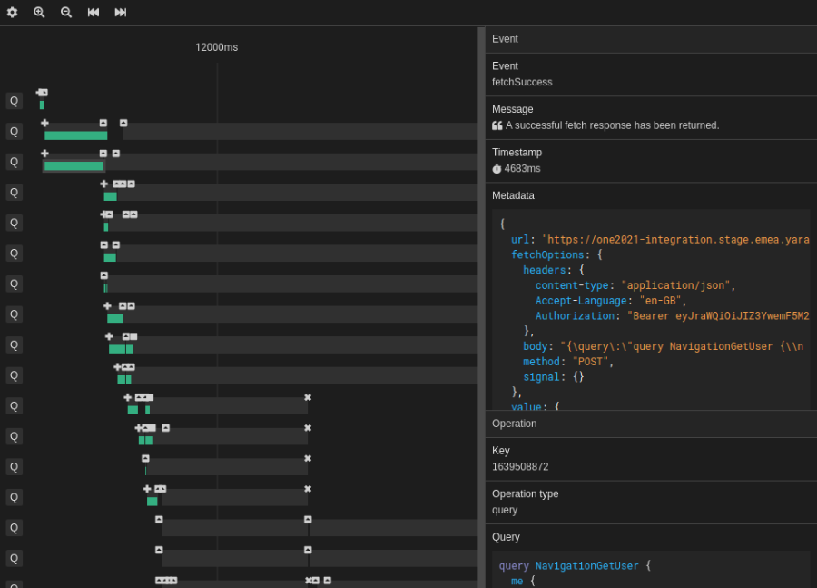
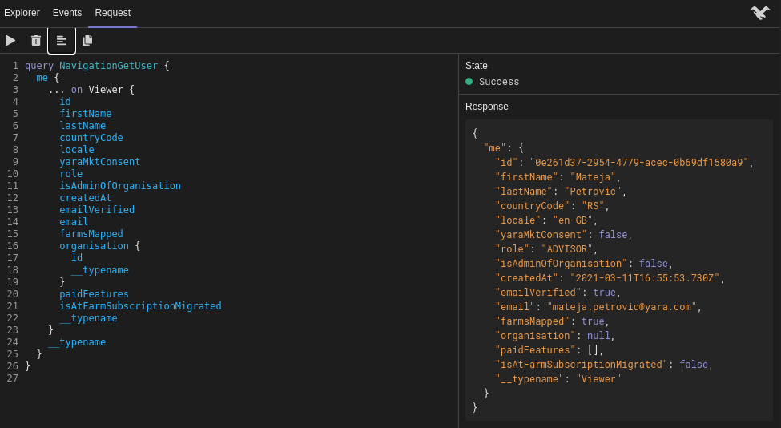

<style>
img {
    display: block;
    margin-left: auto;
    margin-right: auto;
}
</style>

# **React Debugging**


---

## React DevTools Overview

- Component search & selection
- Props overview
- Hooks overview
  - Custom hooks
  - Inspecting `useQuery`

---

<style scoped>
h3 {
  text-align: center;
}
img {
  margin-top: 30px;
}
</style>

### Component Search & Selection




---

<style scoped>
h3 {
  text-align: center;
}
</style>

### Props And Hooks



---

<style scoped>
h3 {
  text-align: center;
  margin-top: -70px;
}
img {
  margin-top: -30px;
}
</style>

### Custom Hooks And Queries



---

## Common Pitfalls

```tsx
const Label = React.forwardRef(() => { // Anonymous
  return <></>
})
const Circle = /* styled.div */ styled.div`
border-radius: 50%;
`
```

```tsx
const Label = () => {
  return <></>
}
export default React.forwardRef(Label) // or React.memo
const Circle = styled.div``
Circle.displayName = 'Circle'
```

---

## File structure

- Matching up file name, component name and prop types interface
  - Snippets
- Default export
- Helper components
  - Component composition (Tabs, Tab, Content)
  - Private components (Table, Row, Cell)
- Utilities functions (reusable, testable)

---

<style scoped>
h2 {
  text-align: center;
}
</style>

## Dubious Example

```tsx
// Tabs.tsx

const formatName = (name: string) => { /* ... */ }

interface Props {
  tabNames: string[]
  tabPanels: React.ReactNode[]
}

export const Panels: React.FC<Props> = (props) => { /* ... */ }

```

---

<style scoped>
h2 {
  text-align: center;
}
code {
  margin-top: -30px;
}
</style>

## With Best Practices

```tsx
// Tabs.tsx
import { formatName } from './utils'

export interface TabNameProps { /* ... */ }
const Tab = (props: TabNameProps): JSX.Element => { /* ... */ }

export interface TabPanelProps { /* ... */ }
const TabPanel = (props: TabNameProps): JSX.Element => { /* ... */ }

export interface TabProps { /* ... */ }
const Tabs: React.FC<TabProps> = (props) => { /* ... */ }

export default Object.assign(Tabs, { Tab, TabPanel })
```

---

## **useMemo** and **useCallback**

- Performance optimization
  - Large lists
- Stabilizing references
  - `React.useEffect` dependencies & infinite loops (backtracking)
- Debugging _intermediate_ & _outgoing_ values
  - Less common in the context of `useCallback`
  - Redundant in case of styling
  - Sometimes a tradeoff between debugging and performance

---

### Stabilizing References

```ts
// useTranslation.tsx

export function useTranslation() {
  function t() { /* ... */ }
  return { t }
}
```

```tsx
// Label.tsx

const { t } = useTranslation();
React.useEffect(() => {
  /* ... */
}, [t])
```

---

### Stabilizing References 1

```ts
// useTranslation.tsx

export function useTranslation() {
  const t = React.useCallback(() =>  {
   /* ... */
  }, [ /* ... */ ]) // include dependencies
  return { t } // ? useMemo
}
```

---

<style scoped>
h3 {
  margin-top: -60px;
}
code {
  margin-top: -30px;
}
</style>

### Debugging _Intermediate_ & _Outgoing_ Values

```tsx
// Table.tsx
const mineralsTotal = props.mineralProducts.reduce(aggregateMinerals, 0)
const organicsTotal = props.organicProducts.reduce(aggregateOrganics, 0)
const total = mineralsTotal + organicsTotal
const productCount = props.mineralProducts.length + props.organicProducts.length
return (
  <table>
    {props.products(product => {
      <Row data={product} total={total} productCount={productCount} />
    })}
  </table>
)
```

```tsx
// Row.tsx
const average = props.total / props.productCount
React.useEffect(() => {
  /* ... */
}, [average])
```

---

<style scoped>
h3 {
  margin-top: -60px;
}
code {
  margin-top: -30px;
}
</style>

### Debugging _Intermediate_ & _Outgoing_ Values 1

```tsx
// Table.tsx
const mineralsTotal = React.useMemo(() =>
  props.mineralProducts.reduce(aggregateMinerals, 0),
[props.mineralProducts])
const organicsTotal = React.useMemo(() =>
  props.mineralProducts.reduce(aggregateOrganics, 0),
[props.mineralProducts])
const total = mineralsTotal + organicsTotal
const productCount = props.mineralProducts.length + props.organicProducts.length
return ( /* ... */ )
```

```tsx
// Row.tsx
const average = React.useMemo(() =>
  props.total / props.productCount,
[props.total, props.productCount])
React.useEffect(() => {
  /* ... */
}, [average])
```

---

## Optimizing Renders

- [React Profiler API](https://reactjs.org/docs/profiler.html)
  - How often did a given component render?
  - How long did the render take?
  - Automatically available in development past version 16.5
  - [Fix the slow render before you fix the re-render](https://kentcdodds.com/blog/fix-the-slow-render-before-you-fix-the-re-render)
- [Why did you render](https://www.npmjs.com/package/@welldone-software/why-did-you-render)

---

<style scoped>
img {
    margin-top: -35px;
    margin-left: -70px;
}
</style>




---

## Ranked Profiler Chart



---

## Circular Dependencies

- Can lead to cryptic errors
  - _`variable` does not exist_
- [Madge](https://www.npmjs.com/package/madge) dependency analysis
  - Visualizing architecture
  - Detecting circular dependencies
  - Detecting orphans & leaves

---

## Urql DevTools

- Previewing cache
  - Cache outcome
- Requests waterfall
- Performing requests

---

<style scoped>
h3 {
  text-align: center;
  margin-top: -70px;
}
img {
  margin-top: -30px;
}
</style>

### Previewing Cache



---

<style scoped>
h3 {
  text-align: center;
  margin-top: -70px;
}
img {
    margin-top: -35px;
}
</style>

### Request Waterfall



---

<style scoped>
h3 {
  text-align: center;
  margin-top: -30px;
}
</style>

### Performing Requests


